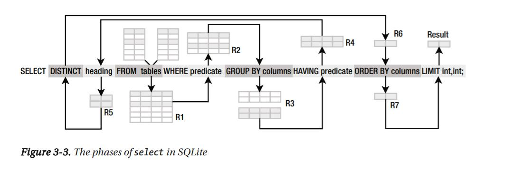

???

I'm going to start with an entirely hypothetical but familiar story...

---
class: center middle

```{css thought-bubble, echo=FALSE}
.bubble p {
  position: relative;
  width: 300px;
  text-align: center;
  line-height: 1.4em;
  margin: 40px auto;
  background-color: #fff;
  border: 8px solid #333;
  border-radius: 30px;
  font-size: 1.25em;
}

.thought p {
  width: 500px;
  border-radius: 200px;
  padding: 30px;  
}

.bubble p:before,
.bubble p:after {
  content: ' ';
  position: absolute;
  width: 0;
  height: 0;
}

.speech p:before {
  left: 30px;
  bottom: -50px;
  border: 25px solid;
  border-color: #333 transparent transparent #333;
}

.speech p:after {
  left: 38px;
  bottom: -30px;
  border: 15px solid;
  border-color: #fff transparent transparent #fff;
}

.thought p:before,
.thought p:after {
  right: 10px;
  bottom: -30px;
  width: 40px;
  height: 40px;
  background-color: #fff;
  border: 8px solid #666;
  -webkit-border-radius: 28px;
  -moz-border-radius: 28px;
  border-radius: 28px;
}

.thought p:after {
  width: 20px;
  height: 20px;
  right: 5px;
  bottom: -40px;
  border-color: #999;
  -webkit-border-radius: 18px;
  -moz-border-radius: 18px;
  border-radius: 18px;
}

/* https://github.com/miniMAC/magic/blob/master/dist/magic.css */
.remark-visible .vanishIn {
  -webkit-animation-name: vanishIn;
          animation-name: vanishIn;
  -webkit-animation-duration: 2s;
          animation-duration: 2s;
  -webkit-animation-fill-mode: both;
          animation-fill-mode: both;
  
}

@-webkit-keyframes vanishIn {
  0% {
    opacity: 0;
    transform-origin: 50% 50%;
    transform: scale(2, 2);
    -webkit-filter: blur(90px);
            filter: blur(90px); }
  100% {
    opacity: 1;
    transform-origin: 50% 50%;
    transform: scale(1, 1);
    -webkit-filter: blur(0px);
            filter: blur(0px); } }

@keyframes vanishIn {
  0% {
    opacity: 0;
    transform-origin: 50% 50%;
    transform: scale(2, 2);
    -webkit-filter: blur(90px);
            filter: blur(90px); }
  100% {
    opacity: 1;
    transform-origin: 50% 50%;
    transform: scale(1, 1);
    -webkit-filter: blur(0px);
            filter: blur(0px); } }
```

.center.w-50[
.bubble.thought.vanishIn[
How do I connect to our .blue[tissue sample inventory] to a patient's .orange[clinical data]?
]

.tr.f6[
&#x1F914;
]
]

???

It starts with a question.  
I want to connect our tissue sample inventory  
to patient clinical data.

It's not something I've done before,  
so I'm not quite sure how to access the samples table  
or how to link a sample to a patient  
but obviously it has to be possible.

So how do I get started?

---
class: no-border no-logo hide-count
background-image: url(figures/big-data-sensor-display.jpg)
background-size: cover
background-position: center right

???

If you believe the big data stock photos,  
I go to the self-service data wall  
and point at the numbers I want.

---

```{css typing-animation, echo=FALSE}
.remark-visible .css-typing p {
  opacity: 0;
  border-right: .15em solid orange;
  white-space: nowrap;
  overflow: hidden;
  -webkit-animation-fill-mode: forwards;
  animation-fill-mode: forwards;
}

.remark-visible .css-typing p:nth-child(1) {
  width: 870px;
  -webkit-animation: type 3s steps(70, end);
  animation: type 3s steps(70, end);
  -webkit-animation-fill-mode: forwards;
  animation-fill-mode: forwards;
}

.remark-visible .css-typing p:nth-child(2) {
  width: 390px;
  -webkit-animation: type 2s steps(31, end);
  animation: type 2s steps(31, end);
  -webkit-animation-fill-mode: forwards;
  animation-fill-mode: forwards;
  -webkit-animation-delay: 4s;
  animation-delay: 4s;
}

.remark-visible .css-typing p:nth-child(3) {
  width: 110px;
  -webkit-animation: type 0.5s steps(7, end);
  animation: type 0.5s steps(7, end);
  -webkit-animation-fill-mode: forwards;
  animation-fill-mode: forwards;
  -webkit-animation-delay: 7s;
  animation-delay: 7s;
}

.remark-visible .css-typing p:nth-child(4) {
  width: 100px;
  -webkit-animation: type 0.5s steps(7, end);
  animation: type 0.5s steps(7, end);
  -webkit-animation-fill-mode: forwards;
  animation-fill-mode: forwards;
  -webkit-animation-delay: 7.5s;
  animation-delay: 7.5s;
}

@keyframes type {
  0% {
    width: 0;
  }
  1% {
    opacity: 1;
  }
  99.9% {
    border-right: .15em solid orange;
  }
  100% {
    opacity: 1;
    border: none;
  }
}

@-webkit-keyframes type {
  0% {
    width: 0;
  }
  1% {
    opacity: 1;
  }
  99.9% {
    border-right: .15em solid orange;
  }
  100% {
    opacity: 1;
    border: none;
  }
}

@keyframes blink {
  50% {
    border-color: transparent;
  }
}
@-webkit-keyframes blink {
  50% {
    border-color: tranparent;
  }
}
```

.ba.b--gray-4.br2.pv2.ph3.mv5.shadow-4.animated.fadeIn[
.b[Aden-Buie, Garrick]<br>
Question about Sample Availability Table  

To: .gray-3[data-ops@acmemed.org]

***

.o-0[
How can I connect our sample inventory to patient-level clinical data?

I've heard you know the secret.

Thanks!

.gray-3[Garrick]
]
]

???

In reality, it probably starts with an email.
Or many emails.

I start by reaching out to someone I know who manages that particular data resource
to see what they can tell me...

---

.ba.b--gray-4.br2.pv2.ph3.mv5.shadow-4[
.b[Aden-Buie, Garrick]<br>
Question about Sample Availability Table  

To: .gray-3[data-ops@acmemed.org]

***

.css-typing[
How can I connect our sample inventory to patient-level clinical data?

I've heard you know the secret.

Thanks!

.gray-3[Garrick]
]
]


---

.w-90.ba.b--gray-4.br2.pv2.ph3.mv5.shadow-4.absolute.animated.lightSpeedOut[
.b[Aden-Buie, Garrick]<br>
Question about Sample Availability Table  

To: .gray-3[data-ops@acmemed.org]

***

How can I connect our sample inventory to patient-level clinical data?

I've heard you know the secret.

Thanks!

.gray-3[Garrick]
]


```{css css-email-attachment, echo=FALSE}
#email-attachment:hover {
  color: #eb1455
}
.zoomForward {
  animation: zoomForward 1s cubic-bezier(.45,-0.12,.51,.71);
  transform-origin: center;
}
@keyframes zoomForward {
  0% {
    transform: scale(1);
  }
  100% {
    opacity: 0;
    transform: scale(25);
  }
}
@-webkit-keyframes zoomForward {
  0% {
    transform: scale(1);
  }
  100% {
    opacity: 0;
    transform: scale(25);
  }
}
```

```{js js-email-attachment, echo=FALSE}
(function() {
  btn = document.getElementById('email-attachment')
  btn.addEventListener('click', function(ev) {
    btn.classList.toggle('zoomForward')
    setTimeout(() => slideshow.gotoNextSlide(), 1000)
    setTimeout(() => btn.classList.remove('zoomForward'), 1500)
  })
})()
```

.ba.b--gray-4.br2.pv2.ph3.mv5.shadow-4.relative.animated.bounceInDown.delay-2s[
.b[Friendly Data Ops Person]<br>
RE: Question about Sample Availability Table  
<div class="w1 absolute right-2 gray-1" id="email-attachment">
<svg aria-hidden="true" focusable="false" data-prefix="far" data-icon="file-code" class="svg-inline--fa fa-file-code fa-w-12" role="img" xmlns="http://www.w3.org/2000/svg" viewBox="0 0 384 512"><path fill="currentColor" d="M149.9 349.1l-.2-.2-32.8-28.9 32.8-28.9c3.6-3.2 4-8.8.8-12.4l-.2-.2-17.4-18.6c-3.4-3.6-9-3.7-12.4-.4l-57.7 54.1c-3.7 3.5-3.7 9.4 0 12.8l57.7 54.1c1.6 1.5 3.8 2.4 6 2.4 2.4 0 4.8-1 6.4-2.8l17.4-18.6c3.3-3.5 3.1-9.1-.4-12.4zm220-251.2L286 14C277 5 264.8-.1 252.1-.1H48C21.5 0 0 21.5 0 48v416c0 26.5 21.5 48 48 48h288c26.5 0 48-21.5 48-48V131.9c0-12.7-5.1-25-14.1-34zM256 51.9l76.1 76.1H256zM336 464H48V48h160v104c0 13.3 10.7 24 24 24h104zM209.6 214c-4.7-1.4-9.5 1.3-10.9 6L144 408.1c-1.4 4.7 1.3 9.6 6 10.9l24.4 7.1c4.7 1.4 9.6-1.4 10.9-6L240 231.9c1.4-4.7-1.3-9.6-6-10.9zm24.5 76.9l.2.2 32.8 28.9-32.8 28.9c-3.6 3.2-4 8.8-.8 12.4l.2.2 17.4 18.6c3.3 3.5 8.9 3.7 12.4.4l57.7-54.1c3.7-3.5 3.7-9.4 0-12.8l-57.7-54.1c-3.5-3.3-9.1-3.2-12.4.4l-17.4 18.6c-3.3 3.5-3.1 9.1.4 12.4z"></path></svg>
</div>

To: .gray-3[Aden-Buie, Garrick]


***
Hey Garrick,

Here's the query we use to populate the table.

Good Luck!

.gray-3[Data Ops]
]

???

I fire off the email and a little while later I get a reply.

_read email_

And look, the email came with an attachment that I can open up.

---

```{css code-two-column, echo=FALSE}
.code-two-column .remark-code {
  font-size: 0.33em;
  -webkit-column-count: 2;
  -moz-column-count: 2;
  column-count: 2;
  -webkit-column-gap: 20px;
  -moz-column-gap: 20px;
  column-gap: 20px;
}

.code-two-column pre {
  margin-top: 0;
  background-color: #FAFAFA;
  padding-left: 1em;
  border-top-left-radius: 8px;
  border-top-right-radius: 8px;
}

.code-window-title-bar {
  border-top-left-radius: 8px;
  border-top-right-radius: 8px;
  padding-top: 10px;
}

.code-window-circle {
  width: 17px;
  height: 18px;
  margin-right: 6px;
}

.code-window-circles {
  position: absolute;
  left: 12px;
  top: 11px;
}
```

.code-two-column.shadow-4.animated.zoomIn[
<div class="code code-window-title-bar ph2 mb0 pv1 mt5 small bg-gray-4 gray-1 center relative">
sample-inventory-patient.sql
<div class="code-window-circles">
  <span class="code-window-circle bg-gray-3 br-100 dib"></span><span class="code-window-circle bg-gray-3 br-100 dib"></span><span class="code-window-circle bg-gray-3 br-100 dib"></span>
</div>
</div>

```{sql example-query, eval=FALSE}
SELECT SA.PERSON_ID,SA.SAMPLE_ID,SA.SAMPLE_FAMILY_ID
,CH1.CHOICE_NAME AS COLLECTION_CONSORTIUM 
,CH2.CHOICE_NAME AS CELFILE_RELATED
,CH3.CHOICE_NAME AS FROZEN_TUMOR_TISSUE
,CH4.CHOICE_NAME AS FROZEN_NORMAL_TISSUE
,CH5.CHOICE_NAME AS WHOLE_BLOOD
,CH6.CHOICE_NAME AS BUFFY_COAT
,CH7.CHOICE_NAME AS DNA_FROM_BLOOD
,CH8.CHOICE_NAME AS PLASMA
,CH9.CHOICE_NAME AS SERUM
,CH10.CHOICE_NAME AS PARAFFIN
,CH11.CHOICE_NAME AS URINE
,CH12.CHOICE_NAME AS RNA
,CH13.CHOICE_NAME AS MNC
,CH14.CHOICE_NAME AS DNA_FROM_SOLID
,CH15.CHOICE_NAME AS ADJACENT_NORMAL
,CH16.CHOICE_NAME AS LCS_PROTOCOL_BLOOD_AVA
,CH17.CHOICE_NAME AS SOO_CATEGORY
,CH36.CHOICE_NAME AS SOO_TISSUETYPE
,CH19.CHOICE_NAME AS HISTOLOGYCAP
,CH20.CHOICE_NAME AS PRIMARY_METASTATIC
,PI.MEDICAL_ID
,PI.PARTNER_ID
,CH21.Anatomic_Site AS SOO_ANATOMICSITE
,CH22.CHOICE_NAME AS GROSS_DIAGNOSIS
,CH23.CHOICE_NAME AS PRIMARY_SITE_PATIENT
,CH24.CHOICE_NAME AS HISTOLOGY_PATIENT
,CH25.CHOICE_NAME AS DERIVED_CATEGORY
,CH27.CHOICE_NAME AS DERIVED_TISSUETYPE
,SA.DERIVED_ANATOMIC_SITE AS DERIVED_ANATOMICSITE
,CH29.TISSUE_TYPE AS COL_SITE_TISSUE_TYPE
,SA.SPECIMEN_COLLECTION_DATE
,CH29.ANATOMIC_SITE AS COL_SITE_ANATOMIC
,CH30.CHOICE_NAME AS COL_SITE_CATEGORY
,SA.BIOBANKING_SUBJECT_ID AS SUBJECT_ID
,CH31.CHOICE_NAME AS WHOLE_EXOME
,CH32.CHOICE_NAME AS TARGET_EXOME
,CH33.CHOICE_NAME AS SAMPLE_TYPE
,SA.CURRENT_QUANTITY
,CH34.CHOICE_NAME AS PATH_DIAGNOSIS_PQC
,SA.SAMPLE_TO_CANR_CHAR_LINK
,CH35.CHOICE_NAME AS PROTOCOL
FROM ABC.SAMPLE SA
LEFT JOIN ABC.CHOICE CH1 ON SA.COLLECTION_FACILITY = CH1.CHOICE_ID
LEFT JOIN ABC.CHOICE CH2 ON SA.CELFILE_RELATED = CH2.CHOICE_ID
LEFT JOIN ABC.PATIENT_INFO PI ON SA.PERSON_ID = PI.PERSON_ID
LEFT JOIN ABC.SAMPLE_INDICATOR SI ON SA.SAMPLE_KEY = SI.SAMPLE_KEY
LEFT JOIN ABC.CHOICE CH3 ON SI.FROZ_TTISE_AVL_FOR_RIND = CH3.CHOICE_ID
LEFT JOIN ABC.CHOICE CH4 ON SI.FROZ_NORM_TISS_AVL_FOR_RIND = CH4.CHOICE_ID
LEFT JOIN ABC.CHOICE CH5 ON SI.WHLBAVLFDNAEXTNDR_INCL_PAXDNAS = CH5.CHOICE_ID
LEFT JOIN ABC.CHOICE CH6 ON SI.BUFY_COAT_AVL_FOR_RIND = CH6.CHOICE_ID
LEFT JOIN ABC.CHOICE CH7 ON SI.DNAEXTRF_BLOD_AVL_FOR_RIND = CH7.CHOICE_ID
LEFT JOIN ABC.CHOICE CH8 ON SI.PLA_AVL_FOR_RIND = CH8.CHOICE_ID
LEFT JOIN ABC.CHOICE CH9 ON SI.SER_AVL_FOR_RIND = CH9.CHOICE_ID
LEFT JOIN ABC.CHOICE CH10 ON SI.PARAF_BLK_AVL_FOR_RIND = CH10.CHOICE_ID
LEFT JOIN ABC.CHOICE CH11 ON SI.UNINE_AVL_FOR_RIND = CH11.CHOICE_ID
LEFT JOIN ABC.CHOICE CH12 ON SI.RNAEXTRF_SOLID_TTISE_FOR_RIND = CH12.CHOICE_ID
LEFT JOIN ABC.CHOICE CH13 ON SI.MONO_CELS_EXTR_FOR_RIND = CH13.CHOICE_ID
LEFT JOIN ABC.CHOICE CH14 ON SI.DNAEXTRF_SOLID_TTISE_FOR_RIND = CH14.CHOICE_ID
LEFT JOIN ABC.CHOICE CH15 ON SI.ADJA_NSLD_SAMPLE_AVL_INDR = CH15.CHOICE_ID
LEFT JOIN ABC.CHOICE CH16 ON SI.LCS_PROTC_BLOD_AVL_FOR_RIND = CH16.CHOICE_ID
LEFT JOIN ABC.CHOICE CH17 ON SA.DERIVED_SOO_CATEGORY = CH17.CHOICE_ID
LEFT JOIN ABC.CHOICE CH18 ON SA.DERIVED_SOO_TISSUE_TYPE = CH18.CHOICE_ID
LEFT JOIN ABC.CHOICE CH19 ON SA.HISTOLOGY_TYPE_CONFORMED_CAP = CH19.CHOICE_ID
LEFT JOIN ABC.CHOICE CH20 ON SA.DERIVED_PRIMARY_VS_METASTATIC = CH20.CHOICE_ID
LEFT JOIN ABC.TISSUE_TYPE CH21 
  ON SUBSTR(SA.DERIVED_SOO_ANATOMIC_SITE,0,8) = CH21.TISSUE_TYPE_KEY
LEFT JOIN ABC.CHOICE CH22 ON SA.DERIVED_GROSS_DIAGNOSIS = CH22.CHOICE_ID
LEFT JOIN ABC.CHOICE CH23 ON SA.PRIMARY_SITE_PATIENT = CH23.CHOICE_ID
LEFT JOIN ABC.CHOICE CH24 ON SA.HISTOLOGY_PATIENT = CH24.CHOICE_ID
LEFT JOIN ABC.CHOICE CH25 ON SA.DERIVED_CATEGORY = CH25.CHOICE_ID
LEFT JOIN ABC.CHOICE CH26 ON SA.DERIVED_TISSUE_TYPE = CH26.CHOICE_ID
LEFT JOIN ABC.CHOICE CH27 ON SA.DERIVED_TISSUE_TYPE = CH27.CHOICE_ID
LEFT JOIN ABC.CHOICE CH28 ON SA.COLLECTION_SITE_TISSUE_TYPE = CH28.CHOICE_ID
LEFT JOIN ABC.TISSUE_TYPE CH29 ON SA.COLLECTION_SITE_ANATOMIC = CH29.TISSUE_TYPE_KEY
LEFT JOIN ABC.CHOICE CH30 ON SA.COLLECTION_SITE_CATEGORY = CH30.CHOICE_ID
LEFT JOIN ABC.CHOICE CH31 ON SI.WHL_EXOM_SEQ_AVL_INDR = CH31.CHOICE_ID
LEFT JOIN ABC.CHOICE CH32 ON SI.TAR_EXOM_SEQ_AVL_INDR = CH32.CHOICE_ID
LEFT JOIN ABC.CHOICE CH33 ON SA.SAMPLE_TYPE = CH33.CHOICE_ID
LEFT JOIN ABC.CHOICE CH34 ON SA.PATH_DIAGNOSIS_PQC = CH34.CHOICE_ID
LEFT JOIN ABC.CHOICE CH35 ON SA.PROTOCOL = CH35.CHOICE_ID
LEFT JOIN ABC.CHOICE CH36 ON SA.DERIVED_SOO_TISSUE_TYPE = CH36.CHOICE_ID
WHERE SA.ISDELETED = 0
```
]

???

And I'm immediately hit with a wall of sequel.

This query doesn't look pretty but in a couple hours I'll probably get the gist of it...

And hey, it's at least code, right?

Well... since we're emailing files around, sometimes you'll get a query like this
in a slightly different format...

---
class: no-logo no-border hide-count word-doc animated-slide slideInRight boingOutDown

```{css ms-word, echo=FALSE}
.word-doc {
  background-image: url('figures/word-doc.png');
  background-size: cover;
  overflow: hidden;
  height: 100%;
  padding-top: 5em;
}

.word-doc pre {
  max-height: 66%;
  overflow: hidden;
  position: absolute;
  width: 90%;
}

.word-doc pre code.sql {
  background: white;
  font-family: sans-serif;
  max-width: 100%;
  overflow-x: hidden;
}

#sql-font-size-down {
  background: transparent;
  width: 35px;
  height: 30px;
  position: absolute;
  top: 77px;
  left: 404px;
  border: none;
  cursor: pointer;
}
#sql-font-size-up {
  background: transparent;
  width: 35px;
  height: 30px;
  position: absolute;
  top: 77px;
  left: 365px;
  border: none;
  cursor: pointer;
}
#sql-font-comic-sans {
  background: transparent;
  text-align: center;
  width: 125px;
  height: 30px;
  padding: 0;
  position: absolute;
  top: 77px;
  left: 138px;
  border: none;
  cursor: pointer;
  font-size: 21px;
}

/* magic.css https://github.com/miniMAC/magic/blob/master/dist/magic.css */
.remark-fading .boingOutDown {
  -webkit-animation-name: boingOutDown;
  animation-name: boingOutDown;
}

@-webkit-keyframes boingOutDown {
  0% {
    opacity: 1;
    transform-origin: 100% 100%;
    transform: perspective(800px) rotateX(0deg) rotateY(0deg); }
  20% {
    opacity: 1;
    transform-origin: 100% 100%;
    transform: perspective(800px) rotateX(0deg) rotateY(10deg); }
  30% {
    opacity: 1;
    transform-origin: 0% 100%;
    transform: perspective(800px) rotateX(0deg) rotateY(0deg); }
  40% {
    opacity: 1;
    transform-origin: 0% 100%;
    transform: perspective(800px) rotateX(10deg) rotateY(10deg); }
  100% {
    opacity: 0;
    transform-origin: 100% 100%;
    transform: perspective(800px) rotateX(90deg) rotateY(0deg); } }

@keyframes boingOutDown {
  0% {
    opacity: 1;
    transform-origin: 100% 100%;
    transform: perspective(800px) rotateX(0deg) rotateY(0deg); }
  20% {
    opacity: 1;
    transform-origin: 100% 100%;
    transform: perspective(800px) rotateX(0deg) rotateY(10deg); }
  30% {
    opacity: 1;
    transform-origin: 0% 100%;
    transform: perspective(800px) rotateX(0deg) rotateY(0deg); }
  40% {
    opacity: 1;
    transform-origin: 0% 100%;
    transform: perspective(800px) rotateX(10deg) rotateY(10deg); }
  100% {
    opacity: 0;
    transform-origin: 100% 100%;
    transform: perspective(800px) rotateX(90deg) rotateY(0deg); } }
```

<button id="sql-font-comic-sans" type="button"></button>
<button id="sql-font-size-up" type="button"></button>
<button id="sql-font-size-down" type="button"></button>

```{sql ref.label="example-query", eval=FALSE}
```

```{js echo=FALSE}
(function() {
  const btnDown = document.getElementById('sql-font-size-down')
  const btnUp = document.getElementById('sql-font-size-up')
  const btnFont = document.getElementById('sql-font-comic-sans')
  const code = document.querySelector('.word-doc pre code')
  let size = 100
  code.style.fontSize = size + '%'
  btnDown.addEventListener('click', function() {
    if (size <= 10) return;
    size = size - 10
    code.style.fontSize = size + '%'
  })
  btnUp.addEventListener('click', function() {
    if (size >= 100) return;
    size = size + 10
    code.style.fontSize = size + '%'
  })
  btnFont.addEventListener('click', function(ev) {
    if (btnFont.innerText === '') {
      btnFont.innerText = 'Comic Sans'
      code.style.fontFamily = '"Comic Sans MS", cursive, sans-serif'
    } else {
      btnFont.innerText = ''
      code.style.fontFamily = 'sans-serif'
    }
  })
})()
```

???

Like a word document!

Where the query doesn't really fit on screen or a page...

and formatting choices are... fluid

---
class: middle animated fadeIn delay-1s

.f6.b[SQL is .red[robot logic] &#x1F916;]



.footnote.tr[
[_Definitive Guide to SQLite_](https://www.apress.com/gp/book/9781430232254)
]

???

Putting aside the emailing and the word document format,
SQL queries aren't a great vehicle for knowledge transfer

They're good for precisely communicating data specifications
in the robot logic databases understand

but we have other ways of working with data
that have been specifically designed with humans in mind

---

class: middle

```{css echo=FALSE}
.focus-ul {
  background-image: linear-gradient(90deg, #eb1455, #eb1455);
  background-size: 0 100%;
  background-repeat: no-repeat;
  transition: background-size 0.25s ease-in, color 0.5s ease-in;
}

.focus-ul:focus {
  outline: none;
  color: #FFF;
  background-size: 100% 100%;
}
```

.f6.b[.code[dplyr] is .green[human logic] &#x1F917;]

<blockquote class = "ml0 lh-copy">
<span style="font-size:1.6em">Programs must be <span class="focus-ul" tabindex="1">written for people to read</span>, and only <span class="focus-ul" tabindex="1">incidentally for machines</span> to execute.</span>

<br><br><cite>Harold Abelson, Structure and Interpretation of Computer Programs</cite>
</blockquote>

???

for example, dplyr

whose API is very intentionally designed  
in line with the philopsophy that code is  
written for people to read  
and only incidentally for machines to execute

Which reminds me of a great quote from Jenny Bryan...

---
class: middle

<div class="f4 blue lh-copy">
Of course someone<br>
has to write for loops.<br>
It doesn't have to be you.
</div>

<div class="f6 red lh-copy">— Jenny Bryan</div>

---
class: middle animated-slide fadeIn

```{css echo=FALSE}
del {
  text-decoration-color: #eb1455;
  text-decoration-thickness: 10px;
}
```

<div class="f4 blue lh-copy">
Of course someone<br>
has to write <del>for loops</del>.<br>
It doesn't have to be you.
</div>

<div class="absolute red f1" style="top: 160px;right: 340px;transform: rotate(-36deg);">↝</div>
<div class="absolute f3 red" style="top: 130px;right: 170px;transform: rotate(-7deg);">SQL</div>

<div class="f6 red lh-copy">— Garrick Aden-Buie</div>

???

Let's take a look at what this query might look like  
in an alternate universe...

---

```{r ex-query-in-r, eval=FALSE}
library(moffittverse)

use_backend("abc")

samples    <- abc_tbl("sample_inventory")
patients   <- abc_tbl("patient")
sample_ind <- abc_tbl("sample_indicators")

samples %>% 
  left_join(sample_ind, by = "SAMPLE_ID") %>% 
  left_join(patients, by = "PERSON_ID") %>% 
  abc_choice_replace() %>% 
  abs_not_deleted()
```